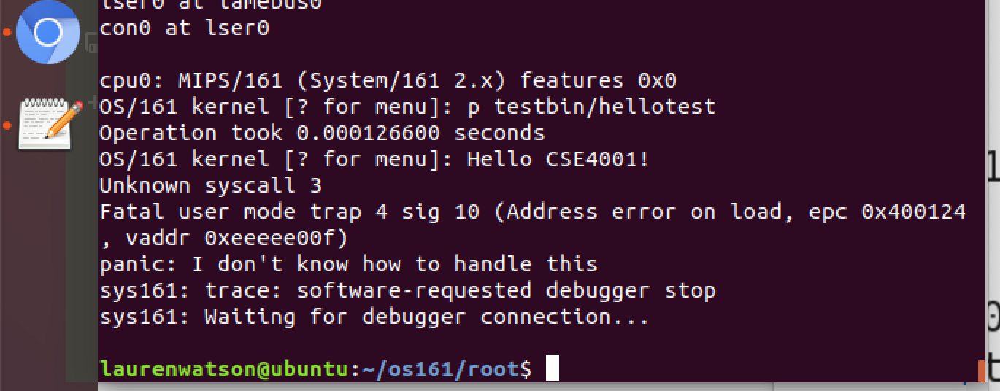

# CSE4001 - Assignment: Add the hello-world system call to OS/161 👋
In this assignment, you'll make a typical modification to OS/161, which is to add a system call.  You will implement: 

- **A simple new system call** (i.e., `hello`). You will need to implement all the steps needed to add a system call to the OS. 
- **The user-level program to test the new system call**. You will implement the test program for `hellow. `

## **Syscall** `int world(void)`

The `hello` system call should be added as system call number 40. Check that the number you choose is not being used by another system call. If number 40 is being already used then just choose another one that is not being used (e.g., 41 or 42). 

This system call is handled by having the kernel print `Hello CSE4001!` and a newline using the internal `kprintf()` function, i.e., this is the kernel version of `printf()` . You will need to understand how to add a new system call number, and build the user and kernel sides of the interface. 

<!-- ### How to test your new system calls:

**Create a new test program**, called `hellotest`, that calls the *helloworld* system call. Create a subdirectory `userland/testbin/hellotest` for the test program, and modify the `Makefile` in the `userland/testbin/` directory so that it is included in the build process.

Use the following program to test the `helloworld()` system call:

```c
#include <unistd.h> 
int main(){
  helloworld();
  return 0;
} 
``` -->

## **Hints for completing the assignment**

- **You must `git clone` the assignment GitHub repository.** Any other option to obtain the kernel files is wrong (e.g., using the download option from GitHub, copying the files from another directory or any other place, forking the repository, invoking the files through an *ouija board*). By *git cloning* the repository, its files  will be under source control and you will be able to edit the source code and `commit/push` any changes into the correct assignment repository on the GitHub server (i.e., the repository created when you accept the assignment through GitHub Classroom). You should not work on any files from a previous assignment. Every `OS/161` assignment has its own specific source code that is provided with the assignment repository. Clone the assignment repository from inside `/root/workspace/` (from inside the container), and using the shell (command line).
 
-  **Update the file `kern/conf/conf.kern`**. In this assignment, you will add new files to the kernel source code. Whenever files are added to OS/161, the configuration files use be updated so *configure* can update the makefiles. Unless the new files are listed in `conf.kern`, they will not be known to the `makefile`, and therefore they will be ignored during the building of the new kernel. As a result, you must update the configuration file `kern/conf/conf.kern` to reflect the presence of any new file. 

- **Do not simply copy and paste the commands from the assignment description.** When reading the instructions for adding system calls, make sure you read the text of the description as well as the commands. You need to understand the steps and not simply copy commands. A few steps might be described only in the text and not explicit commands in the assignment description (e.g., re-configure the kernel, update `conf.kern` to reflect added files). As a result, just copying-and-pasting the listed commands might not work.

- **Test your kernel to make sure it works and read any error messages, if any are printed.** Read the error messages as they usually tell you what the problem is, e.g., undeclared function, syntax error, linking error, unknown library, unknown function.

- **Missing `_exit()`**. If the `_exit()` function is not yet implemented in the codebase that you cloned for the assignment, the kernel will crash with a message "`Unknown syscall #3`". You can ignore this error for now. The error does not mean that your other system calls are not working. You should still see the output of your test program.  Figure 1 shows an example of running `hello()` when `_exit()` is still missing. 

   

   **Figure 1**: Running a system call when `_exit()` is not yet implemented. The system call runs fine but it crashes only because the `_exit()` function is missing. 

 


In this assignment, you will add a new system call to OS/161. 


## Automated testing
This repository tests the kernel automatically whenever new changes are pushed to the repository. To see the details of the tests, open the GitHub Actions tab and select the workflow of the test. The code passes the tests if a green checkmark (✔️) appears besides the label of the latest commit. Failed tests are indicated by a red X (✖️). 


Information on how to use and build OS/161 for CSE4001: 
- https://github.com/eraldoribeiro/UsingCSE4001_OS161
- https://github.com/eribeiroClassroom/notes_github/blob/main/README.md

## The solution :smiley:


### Start the CSE4001 container, and clone the assignment repo

 Start the `CSE4001` container: 
  ```bash
  docker start -i cse4001
  ```

  If the container fails to start, make sure the container is running by calling the `docker run` command. For details see notes: https://github.com/eraldoribeiro/UsingCSE4001_OS161/blob/main/RunningOS161_DockerDesktop.md
  

Clone the assignment repository. Do this from inside `/root/workspace/` in the `CSE4001` container. Use `git clone` or `gh repo clone`. 
    
```bash
cd /root/workspace
gh repo clone <assignment_repository_url
```


### Build the `OS/161` kernel. 

Start by building the current version of the kernel that was just cloned, to ensure that it builds without errors. Open a *Terminal* window. Go into the directory of the repository that was cloned for this assignment, and run the script `build_os161` that is provided in the assignment repository. 
    
The script implements the steps to build both the `kernel` and `userland`. If you want to see the building steps, just open the file of the script in a text editor or read the detailed instructions on how to build `OS/161` (https://github.com/eraldoribeiro/UsingCSE4001_OS161/blob/main/README.md). 

```bash
cd <assignment_repository_url>
./build_os161 <assignment_number>
```

The script’s mode is set to executable. If it does not execute, call `bash build_os161 <assignment number>` .  If the build is successful, the script will print the following: 

```bash
Building done.
  
Now, run sys161 kernel from inside ~/os161/root/
```

### Step-by-step solution

For this assignment, a step-by-step guide to add the system call `hello()` is given here: 
- [Sample solution (Add a new system call to OS/161)](./hello_steps.md). 

As a result, the work needed to complete the assignment is to follow the steps in the sample solution. To help with locating the various files, a diagram showing the files that need to be modified (and their corresponding directories) can be found here: [OS161-directories.pdf](./OS161-directories.pdf)


## Submitting the assignment

To submit the assignment, you will `git commit` and `git push` the changes you made to the code so the changes are sent to the assignment repository on `GitHub.com`.

### Only add source code to the repository 

Try your best to only add source code to the repository. Avoid adding executable and object files. To do that, don't use `git add .` to add all files. Instead, add the few files that need to be added manually by calling `git add <filename>`. 

In addition to adding only the necessary files, run `bmake clean` to remove some unnecessary files. Here, you will run `bmake clean` twice. First, you will run it from the top-level directory of the source code (to clean userland). Then, you will run `bmake clean` from inside `kern/compile/ASST<assignment-number>/`. 


